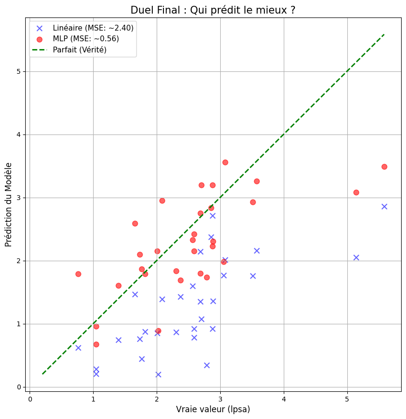

# 🏥 Prédiction du Cancer de la Prostate avec PyTorch

Ce projet explore l'utilisation du Deep Learning pour prédire la sévérité du cancer de la prostate (score `lpsa`) à partir de 8 biomarqueurs cliniques.

L'objectif est de comparer une approche statistique classique (**Régression Linéaire**) avec une approche neuronale (**Perceptron Multi-Couches / MLP**).

## 📊 Résultats Clés

Nous avons comparé les performances sur un jeu de test indépendant (30 patients). L'approche Deep Learning a surpassé la baseline linéaire de manière significative.

| Modèle | Architecture | MSE (Test Loss) | Observation |
| :--- | :--- | :--- | :--- |
| **Régression Linéaire** | 1 Couche (Linéaire) | **~1.98** | Sous-apprentissage (Underfitting) |
| **Réseau de Neurones (MLP)** | 2 Couches (Leaky ReLU) | **~0.46** | **Erreur divisée par 3.5** 🏆 |

### 📉 Comparaison de l'Apprentissage
Le graphique ci-dessous montre comment le MLP (rouge) brise le "plafond de verre" atteint par le modèle linéaire (bleu).


*(Assure-toi d'avoir uploadé l'image ou supprime cette ligne si tu n'as pas l'image)*

### 🆚 Duel Final : Prédictions vs Réalité
On observe clairement que les prédictions du MLP (Rouge) sont beaucoup plus proches de la diagonale idéale que celles du modèle linéaire (Bleu).


*(Assure-toi d'avoir uploadé l'image ou supprime cette ligne si tu n'as pas l'image)*

## 🛠️ Technologies Utilisées
* **Python**
* **PyTorch** (nn.Module, Optimizers, Tensors)
* **Matplotlib** (Visualisation de données)
* **Scikit-Learn** (Preprocessing)

## 🧠 Architecture du MLP (Le Challenger)
Pour battre la régression linéaire, j'ai construit un réseau de neurones avec :
1.  **Input Layer :** 8 neurones (correspondant aux 8 features).
2.  **Hidden Layer :** 16 neurones avec activation **Leaky ReLU** (pour éviter le problème du "Dying ReLU").
3.  **Output Layer :** 1 neurone (prédiction continue).

## 🚀 Comment lancer le projet
1. Cloner le repo :
```bash
git clone [https://github.com/ma3sttro10/Prostate-Cancer-Prediction-PyTorch.git](https://github.com/ma3sttro10/Prostate-Cancer-Prediction-PyTorch.git)
